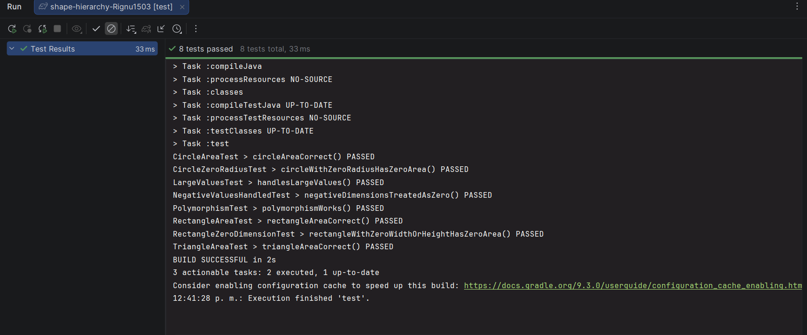

# Shape Hierarchy Lab (Starter)
##Integrantes
Lina Gallardo Corales
Girley Barahona
Yesmith Sarmento
Mary Figueroa
Rigoberto Miranda

Minimal starter: just enough to compile. Implement the classes so tests pass.

## Run tests
```bash
./gradlew test     # macOS/Linux
gradlew.bat test   # Windows
```

## Tasks
- Create a `Shape` interface with `double getArea()` (already provided).
- Complete `Circle`, `Rectangle`, `Triangle` so that:
  - Constructors accept dimensions.
  - `getArea()` returns the correct area.
- In `ShapeHierarchy.main`, create a few shapes and print their areas.
- Edge cases: Treat negative dimensions as `0` for this lab.

> Hints: Use encapsulation (private fields) and keep logic in methods.
 
## Resultados de los test

